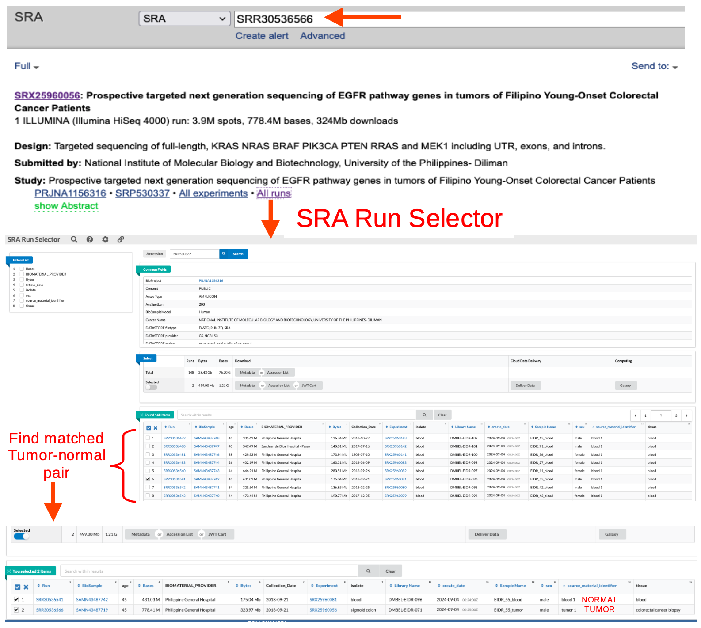
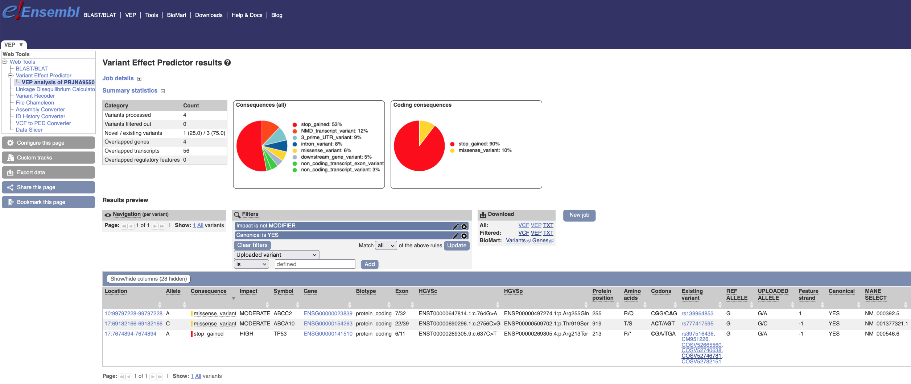

# Part VII – Matched Tumor‑Normal Somatic Analysis (Bash Pipeline)

## Introduction

In [Part IV](README_Part4_fullbash.md) we developed a single Bash pipeline for the full **tumor‑only** somatic analysis. Although tumor-only analysis helps identify somatic variants, it relies on statistical inference and therefore provides only an approximation. In contrast, a matched tumor‑normal pair comparison is **the gold‑standard approach recommended by GATK for maximum accuracy** and, thus, is preferred whenever possible. ***The normal sample allows us to subtract germline variants and greatly reduce false positives.***

What are the differences between these two approaches in somatic analysis? See **Table 1**.

### Table 1: Tumor‑Only vs. Tumor‑Normal Somatic Analysis – Overview

| Feature                  | Tumor‑Only                               | Matched Tumor‑Normal |
|--------------------------|------------------------------------------|----------------------|
| **Input**                | One BAM (tumor)                          | Two BAMs (tumor + normal from same patient) |
| **Germline handling**    | Estimated using population data (gnomAD) | Identified and filtered using the matched normal sample |
| **Normal sample**        | Not available; uses a panel of normals (PON) to filter common artifacts | Matched normal serves as a perfect baseline to subtract germline variants |
| **Core strategy**        | Statistical filtering                    | Biological comparison                    |
| **Sensitivity**          | May miss some somatic variants,<br>especially low‑allelic‑fraction | Higher sensitivity and specificity |
| **Specificity**          | Prone to false positives from sequencing artifacts and germline variants | Much higher specificity; germline variants are removed by subtraction |
| **Resources required**   | PON, germline resource (e.g., gnomAD) | Normal BAM, PON recommended (still useful for artifact filtering) |
| **Reliability**          | Moderate                                 | High (gold standard)                     |

👉 In tumor-only analysis, GATK must ***infer*** what is somatic.

👉 In tumor–normal analysis, GATK can ***directly compare*** tumor and normal samples to identify tumor-specific variants.

---

## Where the Pipelines Are Similar

- **Pre‑processing (identical)**:
    - FastQC / MultiQC
    - Trimming (Cutadapt)
    - Alignment (BWA-MEM)
    - Sorting + MarkDuplicates + MD tags
    - BAM indexing

👉 At this stage, the tumor and normal samples are processed completely independently. They are only combined during somatic variant calling (**Mutect2**).

- Post‑filtering (hard thresholds on depth, allele count, VAF) can be applied to the final somatic calls in the same way.


## Where the Pipelines Are Different

### A. Mutect2


Below are simplified versions of the Mutect2 commands used in each approach:

**Mutect2 command: tumor only**

```bash
gatk Mutect2 \
  -R reference.fasta \
  -I tumor.bam \
  --tumor-sample TUMOR_SM \
  --panel-of-normals PON \
  --germline-resource GNOMAD \
  -L intervals.bed \
  --f1r2-tar-gz f1r2.tar.gz \
  -O output.vcf.gz
```

**Mutect2 command**: tumor–normal version

```bash
gatk Mutect2 \
  -R reference.fasta \
  -I tumor.bam \
  -I normal.bam \
  --tumor-sample TUMOR_SM \
  --normal-sample NORMAL_SM \
  --panel-of-normals PON \
  --germline-resource GNOMAD \
  -L intervals.bed \
  --f1r2-tar-gz f1r2.tar.gz \
  -O output.vcf.gz
```

👉 Mutect2 does not simply “subtract” variants found in the normal. Instead, it evaluates the likelihood that each variant is somatic given the evidence in both tumor and normal samples.

### B. Read group requirement

**Tumor-only**

```bash
RG_SM="EIDR_55_tumor"  # Library Name tumor  // Run: SRR30536566
```

**Tumor-normal**: the samples must be distinguished

```bash
# Tumor
RG_SM="EIDR_55_tumor"  # Library Name tumor  // Run: SRR30536566

# Normal
RG_SM="EIDR_55_blood"  # Library Name normal // Run: SRR30536541
```

👉 The SM (sample name) must match the names provided to `--tumor-sample` and `--normal-sample` in Mutect2.
👉 If they do not match, Mutect2 will not correctly assign reads to tumor vs normal, leading to incorrect variant calls.

### C. Contamination estimation

**Tumor-only**

```bash
GetPileupSummaries (tumor)
→ CalculateContamination
```

**Tumor-normal**

```bash
# Tumor
gatk GetPileupSummaries -I tumor.bam ...

# Normal
gatk GetPileupSummaries -I normal.bam ...

gatk CalculateContamination \
  -I tumor.table \
  --matched-normal normal.table \
  -O contamination.table
```
👉 This allows: 
- detection of contamination in **both samples**
- more accurate correction

The contamination model becomes more accurate because information from the matched normal helps distinguish true somatic variation from contamination and germline signals.

### D. Filtering (FilterMutectCalls)

Command is the same:

```bash
gatk FilterMutectCalls ...
```
But behavior differs:

- Tumor-only → relies on statistical filters
- Tumor–normal → uses direct evidence from the normal sample to identify germline variants and artifacts

👉 Result: fewer false positives

### E. Role of external resources

| Resource               | Tumor-only | Tumor–normal              |
| ---------------------- | ---------- | ------------------------- |
| Panel of Normals (PoN) | Essential  | Recommended               |
| gnomAD                 | Essential  | Helpful but less critical |

👉 The matched normal reduces reliance on these resources **but does not fully replace them**.


### Table 2 (Summary): Differences in Variant Calling between Tumor-Only and Tumor‑Normal

| Aspect | Tumor‑Only | Matched Tumor‑Normal |
|--------|------------|----------------------|
| **Mutect2 command** | Uses `--tumor-sample` only, plus `--panel-of-normals` and `--germline-resource`. | Uses both `--tumor-sample` and `--normal-sample`. The normal BAM is provided with `-I` twice (once for each sample). The PON and germline resource are still used. |
| **Orientation bias model** | Still needed; learned from tumor BAM f1r2 tar. | Still needed; learned from tumor BAM f1r2 tar. |
| **Contamination estimation** | Estimated from tumor BAM using `GetPileupSummaries` and `CalculateContamination`. | Contamination is estimated **separately** for tumor and normal (both can be contaminated). You can run `GetPileupSummaries` on both BAMs and then `CalculateContamination` with `--matched-normal` flag. |
| **Filtering** | `FilterMutectCalls` uses contamination table and orientation model. | Same, but contamination table may include both samples. The matched normal helps in filtering germline variants. |

---

### Summary of Advantages or why matched tumor–normal is the gold standard

| Aspect | Matched Tumor‑Normal Benefit |
|--------|------------------------------|
| **Germline subtraction** | Removes inherited variants, leaving only somatic candidates. |
| **Better artifact filtering** | The normal helps flag sequencing errors and alignment artifacts. |
| **Contamination correction** | Both samples can be assessed for cross‑sample contamination. |
| **Sensitivity** | Better detection of low VAF somatic mutations. |
| **Higher confidence** | Final call set is smaller but more reliable. |


### Visual workflow

A small diagram showing tumor and normal BAMs going through pre-processing independently, then merging in Mutect2

```bash
Tumor FASTQ --> Trim/Align/BAM prep \
                                   --> Mutect2 --> FilterMutectCalls --> Somatic VCF
Normal FASTQ --> Trim/Align/BAM prep /
```

---

## Matched tumor-normal: Project `PRJNA1156316`

We will use the sample `SRR30536566` (tumor - colorectal cancer biopsy) from [Part II – Somatic analysis](README_Part2-3_somatic_analysis.md), but now we also include its matched normal sample `SRR30536541` from the same patient (blood).
The dataset comes from the project `PRJNA1156316` (Filipino Young‑Onset Colorectal Cancer Patients).
- <https://www.ncbi.nlm.nih.gov/sra/?term=PRJNA1156316>


### Getting the matched tumor-normal datasets

1. Go to [SRA](https://www.ncbi.nlm.nih.gov/sra)

2. Type "SRR30536566"

>[!NOTE]
> The dataset "SRR30536566" is one of the "few" available in SRA database. Many requiere an authorised access by **dbGaP**. Details on how this dataset was found, go to chapter "**Find & download small-sized FASTQ datasets for cancer gene panels**" in  👉  [Part I - Preparation & setup](README_Part1-3_setup.md) 

3. Click on "**All runs**". This will send you to the "**SRA RUN SELECTOR**"

4. Copy the Run accession of only the matched tumor–normal pair: `SRR30536566` & `SRR30536541`

>[!NOTE]
> The datasets `SRR30536566` & `SRR30536541` must be from same patient based on "Age", "Collection_Date", "Sample Name", "sex", and "source_material_identifier"

The figure below shows the first 4 steps to get the pair tumor-normal.

**Figure 1: Getting pair tumor-normal datasets from NCBI-SRA**

<p align="center">
  
</p>


>[!IMPORTANT]
> Once getting the Run accessions, the dataset "tumor" and "normal" can be download by:
>
> 1. `fasterq-dump`. Use Terminal to download the dataset for "tumor" and its matched "normal":
> 
> fasterq-dump SRR30536566 \    
  --split-files \		      	  
  --threads 4 \		        	  
  --outdir raw_fastq	  	  	
>
> 2. **ENA**
>
> **ENA** is probably the fastest way of downloading datasets; however, using `fasterq-dump` is more reliable.

5. Paste the Run accession, e.g. `SRR30536566` (tumor), in **[ENA](https://www.ebi.ac.uk/ena/browser/home)** "Search" pane.

6. Select the pairs "**_1**" and "**_2**" for the dataset 

7. Retrieve the `wget` by clicking in "**Get download script**"

You'll get the `wget` in a script, for example `ena-file-download-selected-files-DATE_PROJECT.sh`

8. Make the script executable with: `chmod u+x ena-file-download-selected-files-DATE_PROJECT.sh`

Repeat the download process of `wget` script for the matched normal sample.

---

### Folder structure

This time, the folder structure will be slightly different.

1. In Terminal, move to `~/Genomics_cancer/data/` and create folder `PRJNA1156316` with the subfolders `SRR30536566_tumor` and `SRR30536541_normal`:

```bash
cd ~/Genomics_cancer/data
mkdir -p PRJNA1156316/{SRR30536566_tumor,SRR30536541_normal}
```

2. In addition, the subfolder `raw_fastq` must be created for each folder `~/SRR30536566_tumor` and `~/SRR30536541_normal`.

```bash
cd ~/Genomics_cancer/data/PRJNA1156316/SRR30536566_tumor
mkdir -p raw_fastq
```
Repeat for the normal sample (`~/SRR30536541_normal`)

```bash
cd ../SRR30536541_normal
mkdir -p raw_fastq
```

3. Download the datasets: `./ena-file-download-selected-files-DATE_PROJECT.sh` in its corresponding folder:

- `~/data/PRJNA1156316/SRR30536566_tumor/raw_fastq`
- `~/data/PRJNA1156316/SRR30536541_normal/raw_fastq`


4. Activate Conda environment `DNA2`

```bash
conda activate DNA2
```

### View of folder structure for tumor-normal somatic analysis

```bash
Genomics_cancer/
├── data/
│   └── PRJNA1156316/
│       ├── SRR30536566_tumor/
│       │   └── raw_fastq/
│       │       ├── SRR30536566_1.fastq.gz
│       │       └── SRR30536566_2.fastq.gz
│       └── SRR30536541_normal
│           └── raw_fastq/
│               ├── SRR30536541_1.fastq.gz
│               └── SRR30536541_2.fastq.gz
│   
├── reference/
│   └── GRCh38/
│       ├── fasta/
│       ├── intervals/     
│       └── somatic_resources/    
│   
├── scripts/    
│   └── 09_full_somatic_DNA2_PRJNA1156316_TN.sh
│
└── logs/

```

---

### Results

View of folder structure after running tumor-normal somatic analysis bash script 👉 [09_full_somatic_DNA2_PRJNA1156316_TN.sh](bash_scripts/09_full_somatic_DNA2_PRJNA1156316_TN.sh)

```bash
Genomics_cancer/
├── data/
│   └── PRJNA1156316/
│       ├── SRR30536566_tumor/
│       │   └── raw_fastq/
│       │        ├── SRR30536566_tumor_1.fastq.gz
│       │        └── SRR30536566_tumor_2.fastq.gz
│       │   └── aligned/
│       │       ├── SRR30536566_tumor.markdup.metrics.txt
│       │       ├── SRR30536566_tumor.sorted.markdup.md.bam
│       │       └── SRR30536566_tumor.sorted.markdup.md.bam.bai
│       │   └── logs
│       │       └── bwa_mem.log
│       │       └── cutadapt_SRR30536566_tumor.log
│       │       └── markduplicates_SRR30536566_tumor.log
│       │       └── SRR30536566_tumor.flagstat.txt
│       │       └── SRR30536566_tumor.idxstats.txt
│       │   └── qc
│       │       └── md_flagstat /multiqc_report, multiqc_report.html
│       │       └── raw  / multiqc_report.html, SRR30536566_tumor_1_fastqc.html, SRR30536566_tumor_2_fastqc.html ...
│       │       └── trimmed  / multiqc_report.html, SRR30536566_tumor_R1.trimmed_fastqc.html, SRR30536566_tumor_R2.trimmed_fastqc.html ...
│       │   └── trimmed
│       │       └── SRR30536566_tumor_R1.trimmed.fastq.gz
│       │       └── SRR30536566_tumor_R2.trimmed.fastq.gz
│       │
│       └── SRR30536541_normal
│       │   └── raw_fastq/
│       │        ├── SRR30536541_normal_1.fastq.gz
│       │        └── SRR30536541_normal_2.fastq.gz
│       │   └── aligned                                             # Same as paired tumor
│       │   └── logs                                                # Same as paired tumor
│       │   └── qc                                                  # Same as paired tumor
│       │   └── trimmed
│       │       └── SRR30536541_normal_R1.trimmed.fastq.gz
│       │       └── SRR30536541_normal_R2.trimmed.fastq.gz
│       │
│       └── logs
│       │   └── mutect2.stderr.log                                        
│       │   └── mutect2.stdout.log
│       │   └── PRJNA1156316_calculate_contamination.log
│       │   └── PRJNA1156316_filter_mutect_calls.log
│       │   └── PRJNA1156316_learn_read_orientation_model.log
│       │   └── PRJNA1156316_SRR30536566_normal_get_pileup_summaries.log
│       │   └── PRJNA1156316_SRR30536566_tumor_get_pileup_summaries.log
│       │   └── PRJNA1156316.postfilter.log
│       │
│       └── variants
│       │   └── PRJNA1156316_normal.pileups.table
│       │   └── PRJNA1156316_tumor_normal.unfiltered.vcf.gz
│       │   └── PRJNA1156316_tumor_normal.unfiltered.vcf.gz.stats
│       │   └── PRJNA1156316_tumor_normal.unfiltered.vcf.gz.tbi
│       │   └── PRJNA1156316_tumor.pileups.table
│       │   └── PRJNA1156316.contamination.table
│       │   └── PRJNA1156316.f1r2.tar.gz
│       │   └── PRJNA1156316.filtered.PASS.vcf.gz
│       │   └── PRJNA1156316.filtered.PASS.vcf.gz.tbi
│       │   └── PRJNA1156316.filtered.vcf.gz
│       │   └── PRJNA1156316.filtered.vcf.gz.filteringStats.tsv
│       │   └── PRJNA1156316.filtered.vcf.gz.tbi
│       │   └── PRJNA1156316.postfilter_summary.txt
│       │   └── PRJNA1156316.postfiltered.vcf.gz
│       │   └── PRJNA1156316.postfiltered.vcf.gz.tbi
│       │   └── PRJNA1156316.read-orientation-model.tar.gz
│       │   └── PRJNA1156316.segments.table
├── reference/
│   └── GRCh38/
│       ├── fasta/
│       ├── intervals/     
│       └── somatic_resources/    
│   
└── scripts/    
    └── 09_full_somatic_DNA2_PRJNA1156316_TN.sh

```

### 1. Amount of post-filtered variants: 2 Variants

```bash
cd ~/Genomics_cancer/data/PRJNA1156316/variants

cat PRJNA1156316.postfilter_summary.txt
```

Expected output:
```bash
Post-filter summary
========================
Project: PRJNA1156316
Date: Mon Mar 23 20:51:18 CET 2026

Library type: Amplicon (PCR)
Sequencing: Tumor-Normal (paired)
Post-filtering applied on tumor sample only, normal sample retained for paired analysis

Tumor sample: EIDR_55_tumor
Normal sample: EIDR_55_blood

Input VCF: /Users/Frano/Desktop/Bioinfo_2026/Genomics_cancer/data/PRJNA1156316/variants/PRJNA1156316.filtered.vcf.gz

Thresholds:
  DP >= 200
  ALT reads >= 10
  VAF >= 0.02

PASS variants before post-filtering: 2
Variants retained: 2
```

### 2. Type of somatic variant - genes

```bash
cd ~/Genomics_cancer/data/PRJNA1156316/variants

bcftools view -H -f PASS PRJNA1156316.postfiltered.vcf.gz
```

Expected output:
```bash
chr1	114713909	.	G	T	.	PASS	AS_FilterStatus=SITE;AS_SB_TABLE=1153,1189|61,53;DP=2594;ECNT=1;ECNTH=1;GERMQ=93;MBQ=41,41;MFRL=198,157;MMQ=60,60;MPOS=25;NALOD=-3.255;NLOD=478.11;POPAF=6;ROQ=93;TLOD=318.08;AC=1;AN=4	GT:AD:AF:DP:F1R2:F2R1:FAD:SB	0/1:645,114:0.154:759:240,52:289,43:567,103:327,318,61,53	0/0:1697,0:0.0006186:1697:701,0:837,0:1590,0:826,871,0,0
chr3	179218294	.	G	A	.	PASS	AS_FilterStatus=SITE;AS_SB_TABLE=929,1006|163,184;DP=2378;ECNT=1;ECNTH=1;GERMQ=93;MBQ=41,41;MFRL=191,174;MMQ=60,60;MPOS=24;NALOD=-2.988;NLOD=284.19;POPAF=6;ROQ=93;TLOD=1028.89;AC=1;AN=4	GT:AD:AF:DP:F1R2:F2R1:FAD:SB	0/1:906,347:0.28:1253:358,138:378,149:775,301:451,455,163,184	0/0:1029,0:0.001039:1029:416,0:491,0:945,0:478,551,0,0
```
The exactly same output was observed in `PRJNA1156316.filtered.vcf.gz`


**Summary of postfiltered-variants**

| Variant | Gene | Change | VAF | Depth | TLOD | Passed? | Reason |
|---------|------|--------|-----|-------|------|---------|--------|
| **chr1:114713909** | **NRAS** | G>T | 15.4% | 759 | 318.08 | ✅ PASS | Meets all thresholds |
| **chr3:179218294** | **PIK3CA** | G>A | 28.0% | 1262 | 1253 | ✅ PASS | Meets all thresholds |


---

## Conclusion

In **tumor-only** analysis (see 👉 [Part II - Variant filtering / Which variants PASS?](README_Part2-3_somatic_analysis.md)), the amount of variants after filtering were 4, after the postfiltering 3, and finally 2 after variant annotation. Similarly, the **matched tumor-normal** analysis resulted in also two variables; however, at the variant filtering level. These two variants corresponded, for both analyses: **NRAS** 181G>T / Gln61Lys and **PIK3CA** 1624G>A / Glu542Lys. Therefore, the **matched tumor-normal** analysis could detect better false positive variants and provide more reliable variant outputs.


---

## Matched tumor-normal: Project `PRJNA955019`

- **Web address**: 
    - <https://www.ncbi.nlm.nih.gov/sra/?term=PRJNA955019>
    - <https://www.ncbi.nlm.nih.gov/sra/SRX19950043[accn]>

- **Title**: DNA-seq of H. sapiens: ovarian cancer patients

- **Study**: Germline and somatic variants in candidate therapy resistance biomarker genes in ovarian cancer by targeted sequencing

- datasets:

```bash
Sample: R144 tumor
SAMN34163643 • SRS17298003 • All experiments • All runs
Organism: Homo sapiens
Library:
Name: R144T
Instrument: Illumina NovaSeq 6000
Strategy: Targeted-Capture
Source: GENOMIC
Selection: Hybrid Selection
Layout: PAIRED
RUN: SRR24151892 

Sample: R144 normal
SAMN34163642 • SRS17298004 • All experiments • All runs
Organism: Homo sapiens
Library:
Name: R144K
Instrument: Illumina NovaSeq 6000
Strategy: Targeted-Capture
Source: GENOMIC
Selection: Hybrid Selection
Layout: PAIRED
RUN: SRR24151891	
```

- **ABSTRACT**:
High-grade serous ovarian carcinoma (HGSC) is the most common subtype of ovarian cancer and is among the most fatal gynecological carcinomas in the world. This is due to the late diagnosis at advanced stages and frequent therapy resistance. In 47 HGSC patients, we assessed somatic and germline genetic variability of a custom panel of 144 known or suspected HGSC-related genes by targeted DNA sequencing and identify the genetic determinants associated with resistance to platinum-based therapy. In the germline, the most mutated genes were DNAH14 (17%), RAD51B (17%), CFTR (13%), BRCA1 (11%), and RAD51 (11%). **Somatically**, ***the most mutated gene was TP53 (98%), followed by CSMD1/2/3 (19/19/36%), and CFTR (23%)***. Targeted sequencing results were compared with those from whole exome sequencing of a similar set 35 HGSC patients. Candidate somatic variants in TP53 were also validated using a targeted sequencing GENIE dataset of 1209 HGSC samples. Our high-coverage targeted approach showed higher prevalence of high impact somatic and germline mutations, mainly splice site variants of TP53, when compared to validation datasets. Furthermore, nonsense TP53 somatic mutations were negatively associated with patient survival. Elevated TP53 transcript levels were associated with platinum resistance and presence of TP53 missense mutations. We show that targeted DNA sequencing of TP53 combined with transcript quantification may contribute to the concept of precision oncology of HGSC. Future analyses should include intersections between the expression and mutational profile of other crucial genes and explore targeting the p53 pathway based on specific mutation types.

- **Design**: DNA from tumor tissue samples was isolated by AllPrep DNA/RNA/Protein Mini Kit (Qiagen, Hilden, Germany) following manufacturers protocol. DNA from peripheral blood lymphocytes was isolated and stored according to the published procedure (Topic and Gluhak 1991, PMID 1892954). DNA was quantified using Quant-iT PicoGreen dsDNA Assay Kit for DNA samples (Invitrogen, Waltham, MA, USA) on plate reader Infinite M200 (Tecan Group ltd., Switzerland). Purity of DNA samples was verified by Nanodrop 2000 (ThermoFisher Scientific, Waltham, MA, USA) and calculation of ratios A260/A230. DNA was stored at -20C until further use. Library preparation was performed using the SureSelect XT low input kit (Agilent Technologies, Inc.) with enzymatic fragmentation according to the manufacturers protocol. Targeted sequencies were captured (design 1.3 Mb, custom panel of 100+ OVC-relevant genes) from the individual pools of libraries of 8 for tumors and 24 for normals. **Pooling of libraries for sequencing was done at 5:1 ratio of tumors vs. blood to ensure approximately 5 times higher coverage for tumors**. Sequencing was performed on the Illumina NovaSeq 6000 platform in 150 bp paired-end mode (Illumina Inc.). **"T" in sample name signifies a tumor sample, "K" signifies a normal sample**.

>[!NOTE]
> Bash pipeline: Analysis of datsets from project `PRJNA955019` was performed using the same bash script for matched tumor-normal, project `PRJNA1156316`, with some adaptations in variables `$PROJECT`, `$SAMPLE` among others.

### Results

### 1. Post-filtered variants: 4 variants

```bash
bcftools view -H -f PASS PRJNA955019.postfiltered.vcf.gz
chr8	113314497	.	GC	TT	.	PASS	AS_FilterStatus=SITE;AS_SB_TABLE=560,270|79,28;DP=973;ECNT=1;ECNTH=1;GERMQ=93;MBQ=20,38;MFRL=193,203;MMQ=60,60;MPOS=28;NALOD=-2.31;NLOD=59.6;POPAF=6;ROQ=93;TLOD=379.59;AC=1;AN=4	GT:AD:AF:DP:F1R2:F2R1:FAD:SB	0/1:556,107:0.176:663:208,41:168,40:393,83:373,183,79,28	0/0:274,0:0.004948:274:110,0:78,0:198,0:187,87,0,0
chr10	99797228	.	G	A	.	PASS	AS_FilterStatus=SITE;AS_SB_TABLE=161,168|7,15;DP=365;ECNT=1;ECNTH=1;GERMQ=93;MBQ=27,40;MFRL=208,222;MMQ=60,60;MPOS=30;NALOD=-1.937;NLOD=25.09;POPAF=3.76;ROQ=57;TLOD=53.26;AC=1;AN=4	GT:AD:AF:DP:F1R2:F2R1:FAD:SB	0/1:226,22:0.094:248:91,7:82,11:181,18:114,112,7,15	0/0:103,0:0.011:103:40,0:38,0:84,0:47,56,0,0
chr17	7674894	.	G	A	.	PASS	AS_FilterStatus=SITE;AS_SB_TABLE=268,178|55,34;DP=559;ECNT=1;ECNTH=1;GERMQ=93;MBQ=20,20;MFRL=172,175;MMQ=60,60;MPOS=41;NALOD=-2.172;NLOD=43.22;POPAF=6;ROQ=93;TLOD=217.85;AC=1;AN=4	GT:AD:AF:DP:F1R2:F2R1:FAD:SB	0/1:245,89:0.27:334:76,23:85,36:170,62:146,99,55,34	0/0:201,0:0.006707:201:66,0:68,0:144,0:122,79,0,0
chr17	69182166	.	G	C	.	PASS	AS_FilterStatus=SITE;AS_SB_TABLE=290,218|95,89;DP=702;ECNT=1;ECNTH=1;GERMQ=93;MBQ=20,20;MFRL=170,165;MMQ=60,60;MPOS=40;NALOD=-2.136;NLOD=40.7;POPAF=6;ROQ=93;TLOD=472.03;AC=1;AN=4	GT:AD:AF:DP:F1R2:F2R1:FAD:SB	0/1:316,184:0.369:500:114,66:101,59:220,128:175,141,95,89	0/0:192,0:0.007264:192:71,0:56,0:136,0:115,77,0,0
```


### 2. Somatic Ensembl Variant Annotation (VEP)

Somatic Variant Annotation (VEP)

| Location | Gene | Consequence | Impact | HGVSc | HGVSp | Protein Change | VAF Prediction | Clinical Significance | Known Variant | Notes |
|----------|------|-------------|--------|--------|--------|----------------|----------------|------------------------|----------------|-------|
| chr10:99797228 | ABCC2 | missense_variant | MODERATE | c.764G>A | p.Arg255Gln | R→Q | SIFT: tolerated (0.64), PolyPhen: benign (0.003) | Uncertain significance | rs139964853 | Associated with Dubin-Johnson syndrome |
| chr17:7674894 | TP53 | stop_gained | HIGH | c.637C>T | p.Arg213Ter | R→* (STOP) | - | Pathogenic | rs397516436 | Classic tumor suppressor truncation; linked to Li-Fraumeni syndrome and multiple cancers |
| chr17:69182166 | ABCA10 | missense_variant | MODERATE | c.2756C>G | p.Thr919Ser | T→S | SIFT: tolerated (1), PolyPhen: benign (0.003) | - | rs777417595 | Likely benign or passenger mutation |

>[!IMPORTANT]
> Even though four variants were finally found, only three of them have impact "MODERATE" and "HIGH". The eliminated variant had an impact "MODIFIER", which most probably is not involved as driver nor as passenger of tumor development.

**Figure 2: Annotated variants from Online-VEP. Observe that variants with impact "MODIFIER" were filtered out (see arrow) and those considered "Canonical" were selected (see arrow)**

<p align="center">
  
</p>

### 3. Interpretation table

- **TP53 (chr17:7674894)**: High-impact *stop-gained* mutation leading to protein truncation. This is a well-known pathogenic variant associated with multiple cancers and likely represents a **driver mutation** in the tumor.
- **ABCC2 (chr10:99797228)**: Missense variant with uncertain clinical significance. Likely not a primary driver.
- **ABCA10 (chr17:69182166)**: Predicted benign missense variant, likely a **passenger mutation**.

Overall, the variant profile suggests a tumor with a strong **TP53-driven component**, alongside additional low-impact variants.

| Gene   | Variant     | Type        | Verdict      |
| ------ | ----------- | ----------- | ------------ |
| TP53   | p.Arg213Ter | stop_gained | 🟥 DRIVER    |
| ABCC2  | p.Arg255Gln | missense    | 🟨 passenger |
| ABCA10 | p.Thr919Ser | missense    | 🟨 passenger |


---


👉 [Back to the top](README_Part7_tumor_normal.md#part-vii---matched-tumor-normal-somatic-analysis-bash-pipeline)

👉 [Back to the top](#top)

Go and see somatic NGS analysis in `DNA2` **samtools-updated** environment in 👉 [Part V: Pipeline maintenance and Environment Validation](README_Part5_DNA2_pipeline_update.md)

Jump to the first part of this tutorial 👉 [Part I – Preparation & setup](README_Part1-3_setup.md)

Go to the main page 👉 [Bash_pipeline_NGS](README.md) 

